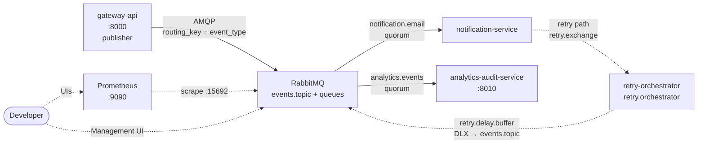
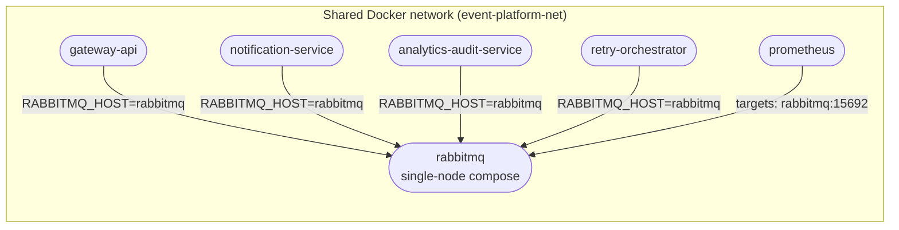
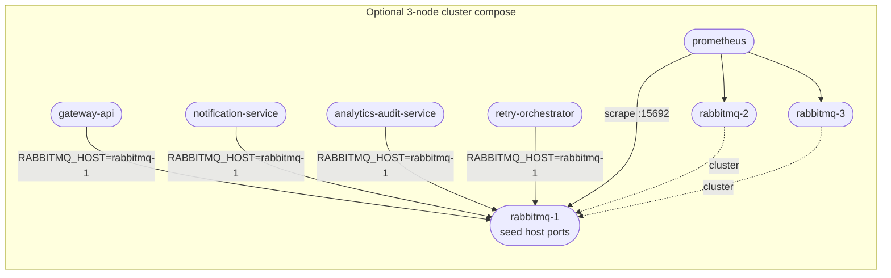

# Event Platform Infra

Docker Compose orchestration for the full event platform stack using **pre-built images from GHCR** (same flow locally and in deployment).

## Message flow (read left → right)

Same convention as the [RabbitMQ tutorials](https://www.rabbitmq.com/tutorials): **one published event** goes **gateway → broker**; the topic **fan-outs** a copy to each bound queue. **Notification** and **analytics-audit** are parallel consumers. **Retry-orchestrator** is *not* another direct fan-out from the topic: it only receives **retry traffic** when notification forwards a `TemporaryError` to `retry.exchange` → **`retry.orchestrator`** (see [retry-orchestrator README](../event-platform-retry-orchestrator-service/README.md)). Critical queues are **quorum** in services; observability (Prometheus) runs **beside** the message path.



## Docker network (hostnames)

**Default stack:** `RABBITMQ_HOST=rabbitmq`; Prometheus scrapes `rabbitmq:15692`. **Optional 3-node stack** ([`docker-compose.rabbitmq-cluster.yml`](docker-compose.rabbitmq-cluster.yml)): apps use `RABBITMQ_HOST=rabbitmq-1`; scrape may target three brokers ([`prometheus.cluster.yml`](prometheus.cluster.yml)). **Not a message timeline** — only DNS resolution in `event-platform-net`.





## Repositories

[GitHub: Elena-sky](https://github.com/Elena-sky)

- [event-platform-gateway-api](https://github.com/Elena-sky/event-platform-gateway-api)
- [event-platform-notification-service](https://github.com/Elena-sky/event-platform-notification-service)
- [event-platform-analytics-audit-service](https://github.com/Elena-sky/event-platform-analytics-audit-service)
- [event-platform-retry-orchestrator-service](https://github.com/Elena-sky/event-platform-retry-orchestrator-service)
- [event-platform-infra](https://github.com/Elena-sky/event-platform-infra)

## Configuration

```bash
cp .env.example .env
cp services/notification.env.example      services/notification.env
cp services/analytics-audit.env.example   services/analytics-audit.env
cp services/gateway.env.example           services/gateway.env
cp services/retry-orchestrator.env.example services/retry-orchestrator.env
```

Edit `.env` for credentials, ports, image versions, and `EVENT_PLATFORM_NETWORK_NAME`. Adjust `services/*.env` if application defaults need to change (do not commit real `services/*.env`).

**CPU architecture (Apple Silicon vs GHCR):** Compose sets `platform` per service. **`DOCKER_PLATFORM_INFRA`** applies to **RabbitMQ** and **Prometheus**; use **`linux/arm64`** locally on ARM Macs so the broker runs natively. **`DOCKER_PLATFORM_APP`** applies to **GHCR application images** — keep **`linux/amd64`** unless you build multi-arch images yourself. See [`.env.example`](.env.example).

## Image versions

Versions are controlled via `.env`:

```dotenv
RETRY_ORCHESTRATOR_VERSION=0.1.0
NOTIFICATION_VERSION=0.1.0
ANALYTICS_AUDIT_VERSION=0.1.0
GATEWAY_VERSION=0.1.0
```

Update a version tag to roll out a new release without touching compose files.

## Requirements

- [Docker](https://docs.docker.com/get-docker/) and Docker Compose v2
- Access to pull images from **GHCR** (`ghcr.io/elena-sky/...`) — log in if the registry or images are private

**CI:** on push/PR to `main` or `master`, [`.github/workflows/ci.yml`](.github/workflows/ci.yml) prepares `.env` and `services/*.env` from the committed examples, then runs `docker compose config --quiet` for both the default [docker-compose.yml](docker-compose.yml) and [docker-compose.rabbitmq-cluster.yml](docker-compose.rabbitmq-cluster.yml).

## Usage

From this directory after [configuration](#configuration):

```bash
docker compose up -d
```

### Scale-out

```bash
docker compose up -d --scale notification-service=3
docker compose up -d --scale analytics-audit-service=2
```

Validate configuration:

```bash
docker compose config
```

Stop:

```bash
docker compose down
```

Stop and remove all data volumes:

```bash
docker compose down -v
```

### Manual phased startup (separate repos)

If you **do not** start everything with one `docker compose up` here, but run each service from its **own repository** (each `docker-compose.yml` attaches to the **external** network `EVENT_PLATFORM_NETWORK_NAME`), bring up only RabbitMQ first:

1. From **this directory**, after `.env` exists:

   ```bash
   docker compose up -d rabbitmq
   ```

2. Wait until RabbitMQ is **healthy** (the healthcheck must pass — only `(healthy)` guarantees AMQP is accepting connections):

   ```bash
   docker ps --filter name=event-platform-rabbitmq
   ```

   The status column should show `(healthy)`, not only `Up`. Allow ~40–60 seconds after start.

3. Then start application stacks in **recommended order** (same network name in each repo’s `.env` as here):

   1. `event-platform-retry-orchestrator-service`
   2. `event-platform-notification-service` (and analytics-audit if you use it)
   3. `event-platform-gateway-api`

For a single-command deploy with ordering handled by Compose, use [`docker compose up -d`](#usage) in this repo instead.

## Troubleshooting

### RabbitMQ exits / restarts (`badmap`, `incompatible_feature_flags`, crash dump)

Often **corrupted or mismatched on-disk state** in the broker volume, or **Erlang under QEMU** when the broker image is **linux/amd64** on an **ARM** Mac.

1. **Reset broker data** (destructive — queues/messages on that volume are lost):

   ```bash
   docker compose down -v
   docker compose up -d
   ```

2. On **Apple Silicon**, set in `.env` (see [`.env.example`](.env.example)):

   ```dotenv
   DOCKER_PLATFORM_INFRA=linux/arm64
   DOCKER_PLATFORM_APP=linux/amd64
   ```

   Then run **`docker compose pull`** (or `docker pull --platform linux/arm64 rabbitmq:3.13-management` once) if Docker still has only the **amd64** layer cached — otherwise you may see *“image does not match the specified platform”*. After that, `docker compose up -d` so **RabbitMQ** and **Prometheus** run **native ARM**; app containers still use **amd64** GHCR images via emulation.

3. Give Docker Desktop **enough RAM** (e.g. 4+ GB) for Erlang/RabbitMQ.

## Queue types (classic vs quorum)

Critical long-lived queues are declared as **quorum** (`x-queue-type: quorum`) for HA / data-safety; the gateway bootstrap queue stays **classic** because it is non-critical and short-lived.

| Queue | Type | Declared in |
|-------|------|-------------|
| `notification.email` | quorum | [event-platform-notification-service](https://github.com/Elena-sky/event-platform-notification-service) |
| `notification.email.dlq` | quorum | notification-service **and** retry-orchestrator (must be byte-equivalent — see warning below) |
| `analytics.events` | quorum | [event-platform-analytics-audit-service](https://github.com/Elena-sky/event-platform-analytics-audit-service) |
| `retry.orchestrator` | quorum | [event-platform-retry-orchestrator-service](https://github.com/Elena-sky/event-platform-retry-orchestrator-service) |
| `retry.delay.buffer` | quorum (also keeps `x-dead-letter-exchange` for TTL-based retry) | retry-orchestrator |
| `events.audit.bootstrap` (gateway) | classic | [event-platform-gateway-api](https://github.com/Elena-sky/event-platform-gateway-api) — intentionally not quorum |

### Why quorum

Quorum queues replace classic mirrored queues as RabbitMQ's recommended replicated queue type (RabbitMQ 3.8+). They use Raft for replication, survive node failures without manual intervention, and are the supported HA path on RabbitMQ 4.x where mirroring is removed.

### Migration from classic → quorum (volume reset required)

Changing `x-queue-type` for an **already declared** queue with the same name is **not allowed** by the broker — the second `queue.declare` will fail with `inequivalent arg 'x-queue-type'`. To migrate locally:

```bash
# from this directory
docker compose down -v   # drops the rabbitmq_data volume
docker compose up -d
```

In production, use a different broker (blue/green) or rename the queues — never `down -v` a live broker that still has unprocessed messages.

### DLQ args must be identical across services

`notification.email.dlq` is declared by **both** `notification-service` and `retry-orchestrator`. Both call sites use the same `QUORUM_QUEUE_ARGS = {"x-queue-type": "quorum"}` constant. If one side adds an extra argument (e.g. `x-message-ttl`) without the other, the second `queue.declare` will be rejected with `inequivalent arg`. Keep them in sync.

### Single-node vs cluster

On a **single-node** broker (default in [`docker-compose.yml`](docker-compose.yml)), quorum queues still survive a process restart (data on disk), but **a single `docker restart` of that node is not the same as a true cluster failover**: with one node, there is no other replica to serve traffic while the broker is down, so clients see an outage until `aio_pika` `connect_robust` / consumer recovery and the broker is back. **True** mirrored quorum behavior needs multiple RabbitMQ cluster members.

**Optional 3-node stack:** use [`docker-compose.rabbitmq-cluster.yml`](docker-compose.rabbitmq-cluster.yml). Set **`COMPOSE_PROJECT_NAME=event-platform-rmq-cluster`** (or any distinct name) when you run it so the stack does not reuse the same Docker volume prefix / container name space as the default one-broker [`docker-compose.yml`](docker-compose.yml) (e.g. avoids clashing with the `rabbitmq` service’s volume).

- Set `RABBITMQ_ERLANG_COOKIE` in `.env` (see [`.env.example`](.env.example)); it must be the same on all nodes. Do not change it after the cluster Mnesia data is created, or the nodes will refuse to start together.
- Stop the **default** stack (or at least free host ports 5672 / 15672 / 15692 / 9090) before bringing up the cluster, or adjust ports in `.env` to avoid conflicts.
- **Start (from this directory):**  
  `export COMPOSE_PROJECT_NAME=event-platform-rmq-cluster`  
  `docker compose -f docker-compose.rabbitmq-cluster.yml up -d`  
  **Tear down including volumes (same `COMPOSE_PROJECT_NAME`):**  
  `docker compose -f docker-compose.rabbitmq-cluster.yml down -v`
- The compose file **overrides** `RABBITMQ_HOST=rabbitmq-1` and (for the gateway) `RABBITMQ_HTTP_API_URL=http://rabbitmq-1:15672` so you do not need a separate `services/*.env` copy. Follower nodes join via [rabbitmq/cluster-node-follower.sh](rabbitmq/cluster-node-follower.sh) (idempotent by a marker in each node’s volume). Only `rabbitmq-1` maps AMQP, Management, and the Prometheus port to the host; nodes 2 and 3 are on the same Docker network only.
- [prometheus.cluster.yml](prometheus.cluster.yml) scrapes all three `rabbitmq-*:15692` targets.
- **Limits:** this is a **local** HA demo. There is **no** AMQP load-balancer: apps use a **single** hostname (`rabbitmq-1`). Losing that exact node is still a single point of view for the client. Production would use more client addresses or a TCP / LB in front of the cluster.
- In the Management UI → *Overview* / *Cluster*, you should see three disc nodes. Quorum queue replicas can then be distributed across the cluster.

### RabbitMQ 4.x note

The repo currently pins `RABBITMQ_IMAGE=rabbitmq:3.13-management`, which already supports quorum queues. RabbitMQ 4.x defaults to `x-delivery-limit=20` for quorum queues; if you bump the image, decide whether your retry policy needs an explicit `x-delivery-limit` argument that aligns with `MAX_RETRIES` in retry-orchestrator.

## Services and ports

| Service | Host port | Description |
|---------|-----------|-------------|
| RabbitMQ AMQP | `RABBITMQ_AMQP_PORT` (see `.env.example`) | Clients on the host |
| Management UI | `RABBITMQ_MANAGEMENT_PORT` | e.g. http://localhost:15672 |

Data volume: `rabbitmq_data`.
