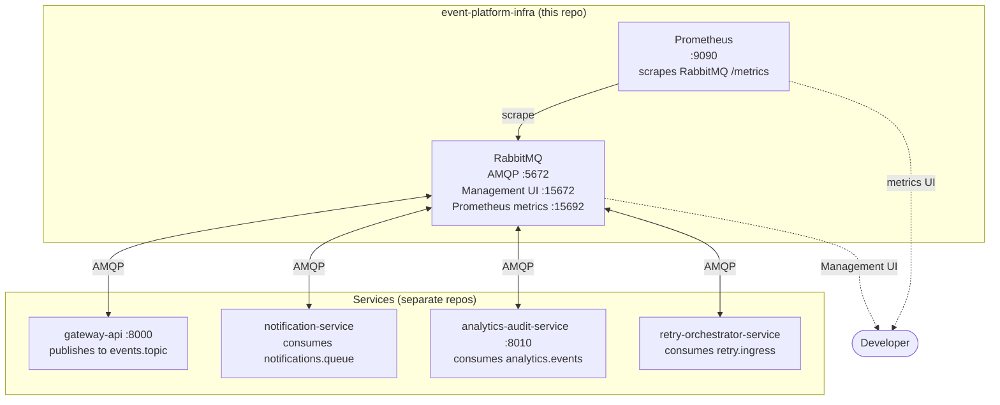
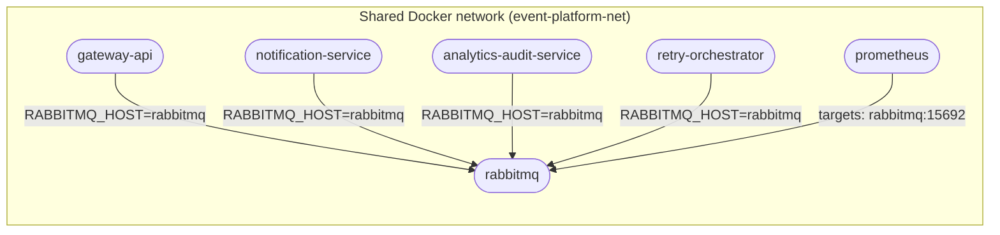

# Event Platform Infra

Docker Compose orchestration for the full event platform stack using **pre-built images from GHCR** (same flow locally and in deployment).

## Topology





## Repositories

[GitHub: Elena-sky](https://github.com/Elena-sky)

- [event-platform-gateway-api](https://github.com/Elena-sky/event-platform-gateway-api)
- [event-platform-notification-service](https://github.com/Elena-sky/event-platform-notification-service)
- [event-platform-analytics-audit-service](https://github.com/Elena-sky/event-platform-analytics-audit-service)
- [event-platform-retry-orchestrator-service](https://github.com/Elena-sky/event-platform-retry-orchestrator-service)
- [event-platform-infra](https://github.com/Elena-sky/event-platform-infra)

## Configuration

```bash
cp .env.example .env
cp services/notification.env.example      services/notification.env
cp services/analytics-audit.env.example   services/analytics-audit.env
cp services/gateway.env.example           services/gateway.env
cp services/retry-orchestrator.env.example services/retry-orchestrator.env
```

Edit `.env` for credentials, ports, image versions, and `EVENT_PLATFORM_NETWORK_NAME`. Adjust `services/*.env` if application defaults need to change (do not commit real `services/*.env`).

## Image versions

Versions are controlled via `.env`:

```dotenv
RETRY_ORCHESTRATOR_VERSION=0.1.0
NOTIFICATION_VERSION=0.1.0
ANALYTICS_AUDIT_VERSION=0.1.0
GATEWAY_VERSION=0.1.0
```

Update a version tag to roll out a new release without touching compose files.

## Requirements

- [Docker](https://docs.docker.com/get-docker/) and Docker Compose v2
- Access to pull images from **GHCR** (`ghcr.io/elena-sky/...`) — log in if the registry or images are private

**CI:** on push/PR to `main` or `master`, [`.github/workflows/ci.yml`](.github/workflows/ci.yml) prepares `.env` and `services/*.env` from the committed examples, then runs `docker compose config --quiet`.

## Usage

From this directory after [configuration](#configuration):

```bash
docker compose up -d
```

### Scale-out

```bash
docker compose up -d --scale notification-service=3
docker compose up -d --scale analytics-audit-service=2
```

Validate configuration:

```bash
docker compose config
```

Stop:

```bash
docker compose down
```

Stop and remove all data volumes:

```bash
docker compose down -v
```

### Manual phased startup (separate repos)

If you **do not** start everything with one `docker compose up` here, but run each service from its **own repository** (each `docker-compose.yml` attaches to the **external** network `EVENT_PLATFORM_NETWORK_NAME`), bring up only RabbitMQ first:

1. From **this directory**, after `.env` exists:

   ```bash
   docker compose up -d rabbitmq
   ```

2. Wait until RabbitMQ is **healthy** (the healthcheck must pass — only `(healthy)` guarantees AMQP is accepting connections):

   ```bash
   docker ps --filter name=event-platform-rabbitmq
   ```

   The status column should show `(healthy)`, not only `Up`. Allow ~40–60 seconds after start.

3. Then start application stacks in **recommended order** (same network name in each repo’s `.env` as here):

   1. `event-platform-retry-orchestrator-service`
   2. `event-platform-notification-service` (and analytics-audit if you use it)
   3. `event-platform-gateway-api`

For a single-command deploy with ordering handled by Compose, use [`docker compose up -d`](#usage) in this repo instead.

## Services and ports

| Service | Host port | Description |
|---------|-----------|-------------|
| RabbitMQ AMQP | `RABBITMQ_AMQP_PORT` (see `.env.example`) | Clients on the host |
| Management UI | `RABBITMQ_MANAGEMENT_PORT` | e.g. http://localhost:15672 |

Data volume: `rabbitmq_data`.
